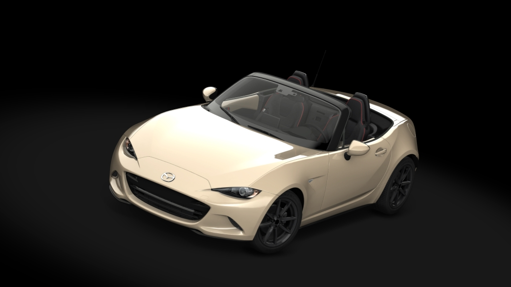

# MX5 ND2 2.0 skyactive-g 184 for Assetto Corsa

This car is modeled after the original MX5 ND in the game, featuring a modified power curve derived from multiple dyno runs of the ND2 with a stock engine.

To use this car in Assetto Corsa, copy the "ks_mazda_mx5_nd2" folder to the "cars" directory. You can then select the car by choosing the standard MX5 ND and changing the car variant from the dropdown menu.

