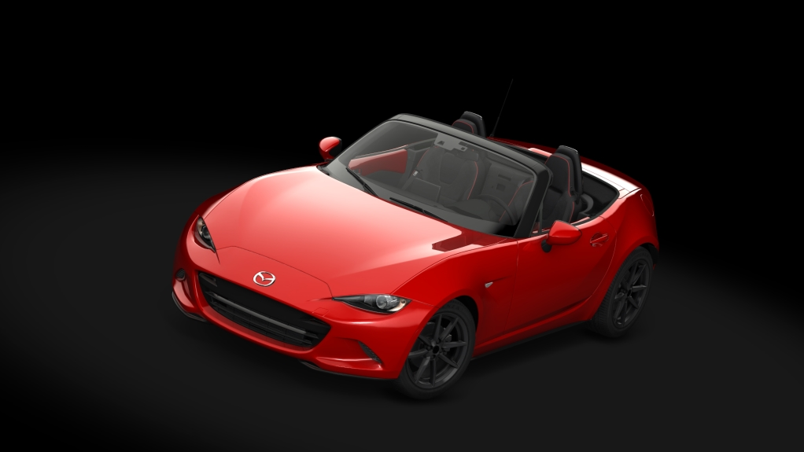
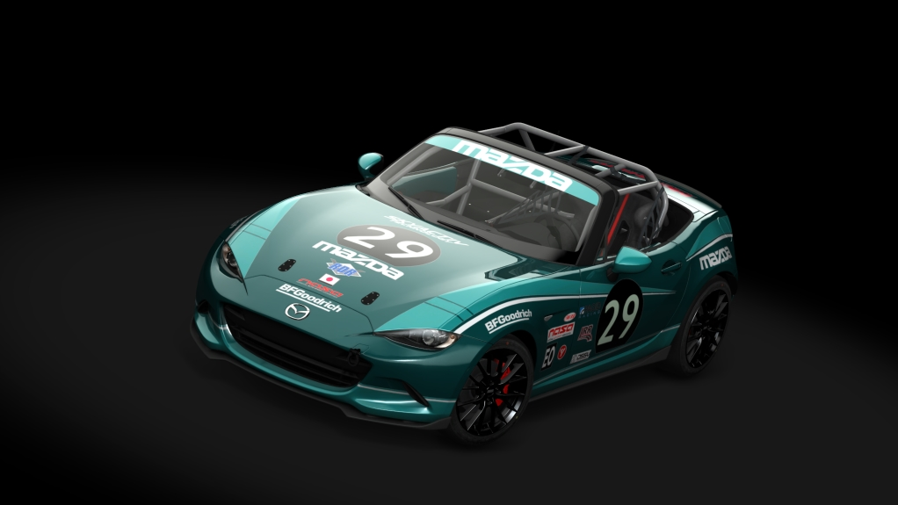

# MX5 ND2 2019 2.0 skyactive-g 184 for Assetto Corsa

This car is modeled after the original MX5 ND in the game, featuring a modified power curve derived from multiple dyno runs of the ND2 with a stock engine.

To use these cars in Assetto Corsa, copy the "ks_mazda_mx5_nd2" and "ks_mazda_mx5_nd2_cup" folders to the "content/cars" directory.

